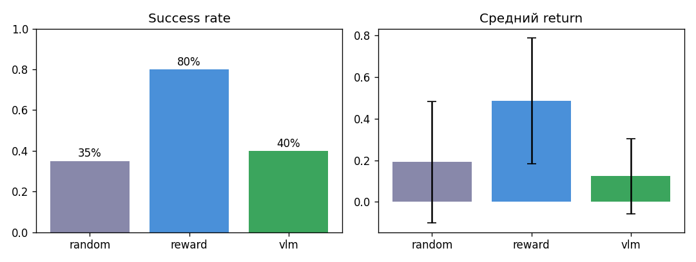
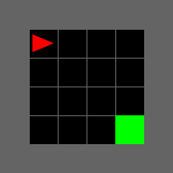
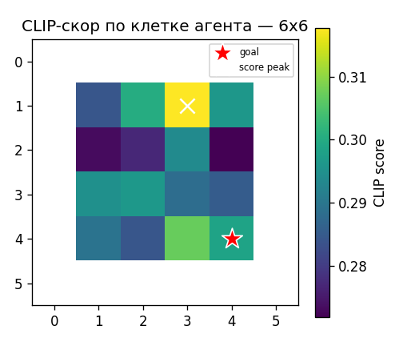

# World Model (RSSM) + VLM-scorer (CLIP) для управления агентом в MiniGrid

Демо-проект, который объединяет **обученную модель мира** и **зрительно-языковой скорер** для
управления агентом в простой среде. Агент задаёт цель словами, «воображает» будущее внутри своей
модели мира и оценивает воображаемые кадры предобученной VLM (CLIP), а действия выбирает через
планирование (MPC / random shooting).

Идея одной фразой: **CLIP оценивает не то, что агент видит сейчас, а то, что он увидит через
несколько шагов** — по кадрам imagined rollout-а из модели мира.

Полный отчёт: [Отчет.pdf](Отчет.pdf) \
Весь код и эксперименты: [rssm_analysis.ipynb](rssm_analysis.ipynb)


## Пайплайн

1. Наблюдение (полный RGB-рендер сетки) кодируется в скрытое состояние **RSSM** world model.
2. Из состояния по последовательности действий раскручивается развёртка на горизонт `H` — без
   обращения к среде.
3. Предсказанные будущие кадры декодируются, **CLIP** превращает каждый в число от 0 до 1
   (близость к текстовой цели).
4. Планировщик (**MPC / random shooting**) перебирает несколько последовательностей действий,
   берёт лучшую по objective, делает её первый шаг и повторяет.

Сравниваются три способа выбирать действия:
- **random** — случайные действия (baseline);
- **WM planning (reward)** — планирование по награде, предсказанной моделью мира (baseline без VLM);
- **WM planning + CLIP** — планирование по CLIP-скору на воображаемых будущих кадрах.


## Главный результат

**Планирование в модели мира работает** (по награде — ~75–80% success rate), но **zero-shot CLIP
как goal-scorer на MiniGrid не сработал** — он примерно на уровне random. При этом простой linear
probe поверх frozen CLIP-признаков «вытаскивает» полезный сигнал и заметно обгоняет zero-shot CLIP.

Метрики (20 эпизодов, общие seeds 0–19, парное сравнение):

| Среда | Метод | Success rate | Return (сред.) |
|-------|-------|:---:|:---:|
| Empty-6x6 | random | 35% | 0.191 |
| Empty-6x6 | **WM planning (reward)** | **80%** | **0.486** |
| Empty-6x6 | WM planning + CLIP | 40% | 0.124 |
| Empty-8x8 | random | 25% | 0.108 |
| Empty-8x8 | **WM planning (reward)** | **75%** | **0.395** |
| Empty-8x8 | WM planning + CLIP | 35% | 0.094 |

<p align="center">
  <br>
  <em>Success rate и средний return трёх методов на MiniGrid-Empty-6x6-v0.</em>
</p>

<p align="center">
  
  <br>
  <em>Слева: успешный эпизод (планирование по награде). Справа: карта CLIP-скора по клетке — её
  максимум (×) не совпадает с целью (★), поэтому планировать по этому сигналу нечем.</em>
</p>


## Ключевые проблемы

- **Domain gap** — CLIP обучался на естественных фото и плохо «понимает» синтетические
  grid-world рендеры MiniGrid.
- **Нет пространственного градиента** — скор не растёт стабильно при приближении к цели, максимум
  не на goal; MPC оптимизирует шумный сигнал.
- **Зависимость от промпта** — формулировка заметно меняет скор, иногда до смены знака корреляции.
- **Real vs imagined mismatch** — скорер видит decoded-кадры из модели мира, а не реальные.
- **Рост ошибки модели мира с горизонтом** — длинные развёртки ненадёжны и ограничивают `H`.

## Будущие исследования

- Калибровать scorer на decoded imagined frames, а не только на реальных кадрах.
- Supervised reward model / linear probe поверх CLIP / SigLIP / DINO признаков (уже простой probe
  сильно помогает).
- Смешанный objective: predicted reward + VLM-скор.
- Улучшать поиск (CEM) или дистиллировать MPC в actor-policy.
- Многошаговые задачи (DoorKey) через subgoals + directed data collection.


## Структура репозитория

```
rssm_analysis.ipynb      # весь код: среда, RSSM, CLIP-scorer, планировщики, эксперименты, анализ
Отчет.pdf                # мини-отчёт
checkpoints/             # обученные веса world model (nb_wm_6x6.pt, nb_wm_8x8.pt)
data/                    # собранные датасеты переходов (nb_6x6.npz, nb_8x8.npz)
outputs/
  nb_6x6/ , nb_8x8/      # results.json, GIF-ы эпизодов, imagined_vs_real.gif, results_bar.png
  analysis/              # графики расширенного анализа (heatmap, probe, latent PCA, CEM, ...)
```

